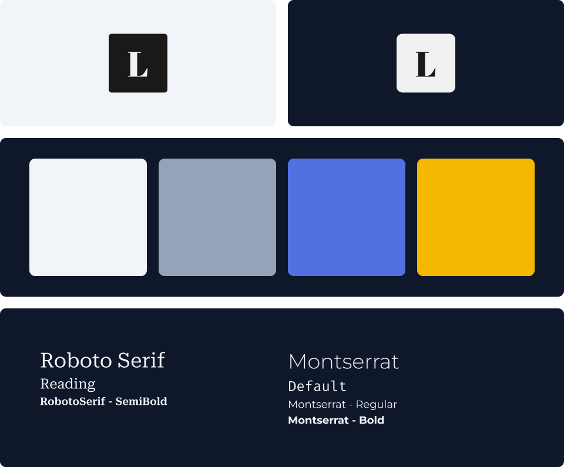

   # [`🏘️ Ituaçu Seguros`](https://ituacu-seguros.vercel.app/) <!-- omit in toc --> 

🏘️ Um site institucional de seguros com muitos serviços a sua disposição!

*Leia em outra língua: [English](README.md).*

   | [Notion](hhttps://evonofy.notion.site/Sobre-O-Projeto-61b07f97bd934afb94690470796c88b7)    | 
   | ------------------------------------------------------------------------------------------ |

   
   

## `Sumário` <!-- omit in toc -->

- [`Recursos 🏷️`](#recursos-️)
- [`Propósito 📜`](#propósito-)
- [`Tecnologias E Pacotes 👨‍💻`](#tecnologias-e-pacotes-)

### `Recursos 🏷️`
- Formulário customizado que determina o seguro correto para o cliente;
- Redirecionamento para o Zap com texto pré-formatado contendo informações do seguro escolhido.

### `Propósito 📜`
Criar um site institucional que facilita a contratação de seguros para você, sua família e seu negócio.

### `Tecnologias E Pacotes 👨‍💻`

 
   
   
   

 

- [Yarn]()

[⬆ De Volta Ao Topo](#-ituaçu-seguros)