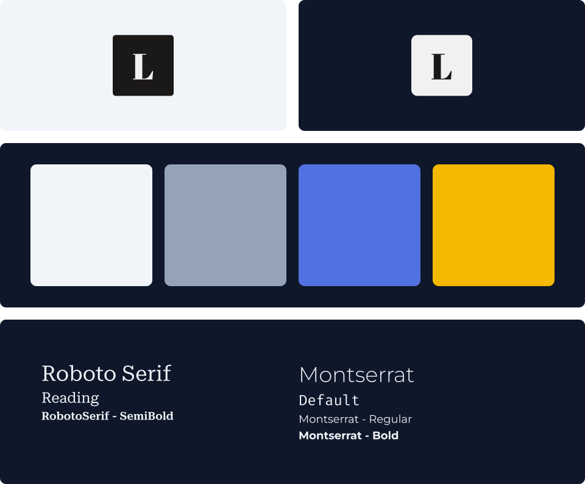

   # [🏘️ `Ituaçu Seguros`](https://ituacu-seguros.vercel.app/) <!-- omit in toc --> 

🏘️ A institucional and insurance website with a lot of services to pick from!

*Read in another language: [Português](README.md).*

   | [Notion](https://evonofy.notion.site/Sobre-O-Projeto-61b07f97bd934afb94690470796c88b7)    | 
   | ----------------------------------------------------------------------------------------- |

   
   

# `Table Of Contents` <!-- omit in toc -->

- [🏷️ `Features`](#️-features)
- [📜 `Purpose`](#-purpose)
- [👨‍💻 `Technologies And Packages`](#-technologies-and-packages)

## 🏷️ `Features`
- Custom form to determine what insurance the client needs;
- Redirection to WPZ with pre-formatted text containing information of the selected insurance.

## 📜 `Purpose`
Make a easy-to-contract insurance insurance website for you, your family and businesses.

## 👨‍💻 `Technologies And Packages`

 
   
   
   

 

- [Yarn]()